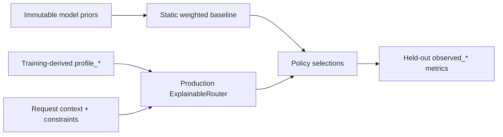

# EvalRoute: Evaluation-Guided Multi-Objective LLM Routing

EvalRoute is a research prototype for one question:

> Can held-out evaluation feedback improve LLM selection under quality, latency, cost, and reliability constraints compared with immutable model priors?

## Start with the research path

The focused entry point is [`research/`](research/README.md). It links only the router, profile scoring, leakage-safe experiments, focused tests, and research documentation. The large application surfaces elsewhere in the repository are optional integration context, not the research contribution.

> **Evidence boundary:** checked-in results use a 12-row synthetic fixture. They verify policy separation, data-flow integrity, and report generation; they are not evidence of real-model superiority. See [Results](docs/RESULTS.md).

The experiment enforces three design boundaries:

1. `static_weighted` reads only immutable per-model priors from `experiments/config/static_model_priors.json`;
2. `evalroute_feedback` reads training-derived `profile_*` fields and calls the production `ExplainableRouter` directly;
3. selection never reads held-out `observed_*` fields, while final metrics read only `observed_*` fields.



## 30-second reproduction

Python 3.10+ is sufficient:

```powershell
python experiments/run_experiments.py
python -m unittest discover -s tests/gateway -p test_routing.py -v
python -m unittest discover -s tests/experiments -v
```

On Windows, run the complete research verification with:

```powershell
.\scripts\verify-research.ps1
```

Generated evidence is written to `experiments/results/demo-results.json` and `experiments/results/demo-results.md`.

## Experiment input contract

Each JSONL row is one request/model pair. Pre-selection information and post-invocation outcomes are intentionally separate:

```json
{
  "request": "r1",
  "task": "code",
  "model": "model-a",
  "profile_quality": 0.82,
  "profile_latency_ms": 720,
  "profile_cost": 0.009,
  "profile_reliability": 0.97,
  "profile_sample_count": 50,
  "profile_age_days": 3,
  "observed_quality": 0.86,
  "observed_latency_ms": 810,
  "observed_cost": 0.011,
  "observed_success": 1
}
```

Legacy rows containing only `quality`, `latency_ms`, `cost`, and `success` are rejected. Empirical input also requires a separate static-prior configuration:

```powershell
python experiments/run_experiments.py `
  --input path/to/observations.jsonl `
  --static-priors path/to/static_model_priors.json `
  --output-dir experiments/results/empirical `
  --evidence-level empirical
```

## Synthetic smoke-test output

| Policy | Quality | Mean latency | Mean cost | Success | Constraint violations |
|---|---:|---:|---:|---:|---:|
| Fixed strongest | 0.8450 | 812.50 ms | 0.012000 | 1.0000 | 0.7500 |
| Fixed cheapest | 0.7100 | 265.00 ms | 0.002000 | 0.7500 | 0.0000 |
| Static weighted | 0.8275 | 462.50 ms | 0.005500 | 1.0000 | 0.0000 |
| EvalRoute feedback | 0.7925 | 382.50 ms | 0.004000 | 1.0000 | 0.0000 |

The table shows different selections under the default constraints, and a focused regression case makes every candidate feasible and still confirms different selections. This demonstrates that the implementations are distinct; it does not support H1 or claim that feedback is better.

## Contribution boundary

The original research work covers the seven-dimensional explainable router, stable reference scoring, task-specific capability profiles, confidence/freshness adjustment, audit explanations, leakage-safe policy evaluation, sensitivity/ablation/failure studies, tests, and methodology.

The gateway, evaluation service, database, SDK, frontends, deployment configuration, and historical platform features form an optional integration prototype. Project origins and attribution are recorded in [Project Origins and Contributions](docs/PROVENANCE.md).

## Documentation

- [Focused research map](research/README.md)
- [Core algorithm](docs/CORE_MODULE.md)
- [Architecture](docs/ARCHITECTURE.md)
- [Evaluation methodology](docs/METHODOLOGY.md)
- [Results and interpretation](docs/RESULTS.md)
- [Technical report](docs/TECHNICAL_REPORT.md)
- [Project origins and contributions](docs/PROVENANCE.md)
