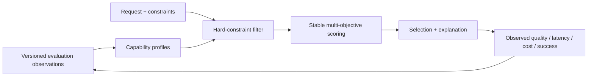

# EvalRoute: Evaluation-Guided Multi-Objective LLM Routing

EvalRoute is a research prototype for one question:

> Can evaluation feedback improve LLM selection under quality, latency, cost, and reliability constraints?

The project turns model evaluation results into versioned capability profiles, applies hard request constraints, and ranks eligible models with an explainable multi-objective score. The research core is Python and runs without a database, API key, GPU, or third-party package.

> **Evidence boundary:** the checked-in results use a 12-row synthetic fixture. They verify the experiment pipeline but are **not** evidence that EvalRoute outperforms a baseline on real models. See [Results](docs/RESULTS.md) and [Provenance](docs/PROVENANCE.md).

## My Contributions

I designed and implemented:

- the multi-objective LLM routing formulation;
- hard constraint filtering before candidate ranking;
- stable reference-based cost and latency scoring;
- capability-profile feedback with sample confidence and freshness adjustment;
- deterministic selection, fallback ordering, and candidate-level explanations;
- eight routing baselines, weight sensitivity, signal ablations, failure/drift experiments, Pareto analysis, and repeated-trial uncertainty summaries;
- 40 focused checks covering routing edge cases, evaluation aggregation, experiment metrics, and the profile-to-routing feedback loop;
- the reproducibility protocol, empirical-data leakage guardrails, and evaluation methodology.

The core implementation is concentrated in `services/gateway/app/routing/explainable_router.py`, `services/evaluation/app/scoring/profile_scoring.py`, `experiments/routing_experiments.py`, and `tests/`. Legacy platform features and migrated frontend applications are identified in [Provenance](docs/PROVENANCE.md) and are not claimed as original research work.



## Project status

| Stage | Scope |
|---|---|
| Implemented | Dependency-free router, offline policy evaluation, audit explanations, synthetic reproducibility suite, and focused tests |
| Experimental | FastAPI profile feedback, AI-as-a-judge signal, database-backed decision/outcome audit, and provider fallback |
| Planned | A licensed 200–500 example multilingual benchmark, 3–5 real models, blinded human audit, held-out weight selection, bootstrap intervals, and learned policies |

## 30-second reproduction

Python 3.10+ is sufficient:

```powershell
python experiments/run_experiments.py
python -m unittest discover -s tests/gateway -p test_routing.py -v
python -m unittest discover -s tests/experiments -v
```

On Windows, the complete dependency-free research verification is:

```powershell
.\scripts\verify-research.ps1
```

Generated evidence is written to `experiments/results/demo-results.json` and `experiments/results/demo-results.md`.

To evaluate a real exported observation file:

```powershell
python experiments/run_experiments.py `
  --input path/to/observations.jsonl `
  --output-dir experiments/results/empirical `
  --evidence-level empirical `
  --repeats 30
```

Each JSONL row must identify a request/task/model and include held-out `quality`, `latency_ms`, `cost`, and `success`. Runs labelled `empirical` must also provide precomputed `profile_quality`, `profile_reliability`, and `profile_sample_count`; the CLI rejects empirical labels without them to reduce held-out outcome leakage. The report records the input SHA-256 hash. The collection protocol and required provenance are documented in [Methodology](docs/METHODOLOGY.md) and the [Dataset Card](benchmark/DATASET_CARD.md).

## Synthetic smoke-test output

These values are included only so a reviewer can confirm what the command should produce:

| Policy | Quality | Mean latency | Mean cost | Success | Constraint violations |
|---|---:|---:|---:|---:|---:|
| Fixed strongest | 0.8450 | 812.50 ms | 0.012000 | 1.0000 | 0.7500 |
| Fixed cheapest | 0.7100 | 265.00 ms | 0.002000 | 0.7500 | 0.0000 |
| Static weighted | 0.7925 | 382.50 ms | 0.004000 | 1.0000 | 0.0000 |
| EvalRoute feedback | 0.7925 | 382.50 ms | 0.004000 | 1.0000 | 0.0000 |

On this tiny fixture, feedback routing ties static weighted routing. This is a useful negative result: the fixture validates mechanics, not research superiority.

## Repository map

```text
benchmark/              Dataset schema, starter data, and Dataset Card
experiments/            Offline policies, ablations, drift tests, and reports
tests/                  Focused routing, evaluation, experiment, and feedback tests
services/gateway/       Integrated FastAPI gateway; research router lives here
services/evaluation/    Integrated evaluation service; profile scoring lives here
docs/                   Architecture, method, results, provenance, and report
sdk/python/             Optional client SDK
```

## Full integrated prototype

The optional two-service prototype requires Python 3.10+, Node.js 22+, Docker Desktop, MySQL, and Redis:

```powershell
Copy-Item .env.example .env
Copy-Item services/gateway/.env.example services/gateway/.env
Copy-Item services/evaluation/.env.example services/evaluation/.env
.\scripts\setup-local.ps1
.\scripts\start.ps1
```


## Documentation

- [Core algorithm](docs/CORE_MODULE.md)
- [Architecture](docs/ARCHITECTURE.md)
- [Evaluation methodology](docs/METHODOLOGY.md)
- [Results and interpretation](docs/RESULTS.md)
- [Technical report](docs/TECHNICAL_REPORT.md)
- [Provenance and licensing](docs/PROVENANCE.md)
