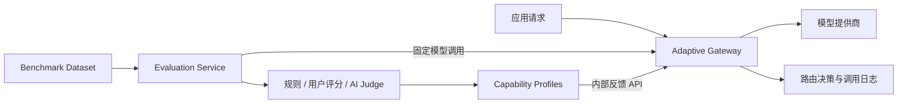

# EvalRoute：评测驱动的自适应大模型网关

EvalRoute 是一个 Python-only 的企业级 LLM 基础设施项目。它把模型网关与模型评测平台连接成反馈闭环：评测服务统一通过网关调用模型，评测结果生成模型能力画像，网关再根据任务类型，在质量、延迟、成本和可靠性之间进行多目标路由。



## 已实现能力

- OpenAI 兼容的 `/api/v1/chat/completions` 与 `/api/v1/models`。
- 固定、成本优先、延迟优先和评测驱动的自适应路由。
- 任务感知的多目标评分：质量、延迟、成本、可靠性，可由请求覆盖权重。
- 模型能力画像版本、评测运行 ID、候选快照、降级顺序和端到端 Trace。
- 批量评测、Side-by-Side、Prompt Lab、用户评分、AI Judge 与报告。
- 评测结果聚合并回写网关画像的闭环接口。
- 单个 MySQL 容器中的两个独立数据库和账号；单个 Redis 通过键前缀隔离。
- Python SDK：`evalroute_sdk`。
- 五组可复现实验的运行脚本、基准数据集与 Dataset Card。

## 仓库结构

```text
services/gateway/       FastAPI 网关、路由、计费、审计
services/evaluation/    FastAPI 评测、批量任务、能力画像反馈
web/gateway/            网关控制台（Vue + Vite）
web/evaluation/         评测工作台（Vue + Vite）
sdk/python/             EvalRoute Python SDK
benchmark/              数据集与 Dataset Card
experiments/            五组实验与结果输出目录
infrastructure/         MySQL 初始化与 Nginx 配置
docs/                   架构、方法、限制、英文技术报告
```

## 本机开发环境

项目采用以下运行方式：

- Docker：只运行 MySQL 8 和 Redis 7。
- 本机 Python：运行 Gateway 和 Evaluation 两个 FastAPI 服务，各自使用独立虚拟环境。
- 本机 Node.js：运行两个 Vue/Vite 前端。

环境要求：Python 3.10+、Node.js 22+、Docker Desktop，以及 PowerShell 7（推荐）。

首次运行前复制环境变量模板，并为所有密码、Token 与 Secret 项填写本机专用的随机值：

```powershell
Copy-Item .env.example .env
Copy-Item services/gateway/.env.example services/gateway/.env
Copy-Item services/evaluation/.env.example services/evaluation/.env
```

这些 `.env` 文件已被 Git 忽略，不应提交。仓库不包含默认密码、API Key 或生产数据库配置。

首次安装依赖：

```powershell
.\scripts\setup-local.ps1
```

如需真实模型调用，在 `services/gateway/.env` 中填写 `AI_API_KEY`。如果该文件尚不存在，启动脚本会从 `.env.example` 自动创建。

启动全部服务：

```powershell
.\scripts\start.ps1
```

停止全部服务：

```powershell
.\scripts\stop.ps1
```

本机地址：

| 服务 | 地址 | 运行位置 |
|---|---|---|
| **统一平台入口** | **`http://localhost:5172/`** | 本机 Python 静态服务 |
| 网关工作台（子模块） | `http://localhost:5173/` | 本机 Node.js |
| 评测工作台（子模块） | `http://localhost:5174/` | 本机 Node.js |
| 网关 API | `http://localhost:8123/api` | 本机 Python |
| 网关 Swagger | `http://localhost:8123/docs` | 本机 Python |
| 评测 API | `http://localhost:8124/api` | 本机 Python |
| 评测 Swagger | `http://localhost:8124/api/docs` | 本机 Python |
| MySQL | `localhost:3308` | Docker |
| Redis | `localhost:6379` | Docker |

仓库不会初始化带有固定密码的默认账号。请在本地通过注册/管理流程创建账号，并为内部服务配置独立凭据。

## 关键闭环

网关请求不传 `model` 时走自适应路由：

```json
{
  "messages": [{"role": "user", "content": "总结这段客服记录"}],
  "task_type": "summarization",
  "routing_weights": {
    "quality": 0.5,
    "latency": 0.2,
    "cost": 0.15,
    "reliability": 0.15
  }
}
```

指定 `model` 时为固定模型调用，适合可复现评测。评测完成后调用 `POST /api/model-profiles/rebuild` 聚合结果，并将新的能力画像发布给网关。
