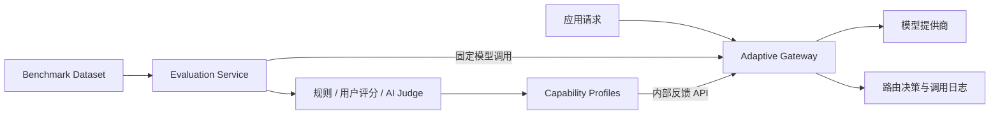

# EvalRoute：评测驱动的自适应大模型网关

EvalRoute 是一个 Python-only 的企业级 LLM 基础设施项目。它把模型网关与模型评测平台连接成反馈闭环：评测服务统一通过网关调用模型，评测结果生成模型能力画像，网关再根据任务类型，在质量、延迟、成本和可靠性之间进行多目标路由。


```mermaid
flowchart LR
  U["应用请求"] --> G["Adaptive Gateway"]
  G --> P["模型提供商"]
  G --> D["路由决策与调用日志"]
  B["Benchmark Dataset"] --> E["Evaluation Service"]
  E -->|"固定模型调用"| G
  E --> R["规则 / 用户评分 / AI Judge"]
  R --> C["Capability Profiles"]
  C -->|"内部反馈 API"| G
```

## 已实现能力

- OpenAI 兼容的 `/api/v1/chat/completions` 与 `/api/v1/models`。
- 固定、成本优先、延迟优先和评测驱动的自适应路由。
- 任务感知的多目标评分：质量、延迟、成本、可靠性，可由请求覆盖权重。
- 模型能力画像版本、评测运行 ID、候选快照、降级顺序和端到端 Trace。
- 批量评测、Side-by-Side、Prompt Lab、用户评分、AI Judge 与报告。
- 批次完成后自动聚合画像、样本门槛校验、回写网关与失败重试，也保留手动重建接口。
- 单个 MySQL 容器中的两个独立数据库和账号；单个 Redis 通过键前缀隔离。
- Python SDK：`evalroute_sdk`。
- 五组可复现实验的运行脚本、基准数据集与 Dataset Card。

## 仓库结构

```text
services/gateway/       FastAPI 网关、路由、计费、审计
services/evaluation/    FastAPI 评测、批量任务、能力画像反馈
web/gateway/            网关控制台（Vue + Vite）
web/evaluation/         评测工作台（Vue + Vite）
sdk/python/             EvalRoute Python SDK
benchmark/              数据集与 Dataset Card
experiments/            五组实验与结果输出目录
infrastructure/         MySQL 初始化与 Nginx 配置
docs/                   架构、方法、限制、英文技术报告
```

## 本机开发环境

项目采用以下运行方式：

- Docker：只运行 MySQL 8 和 Redis 7。
- 本机 Python：运行 Gateway 和 Evaluation 两个 FastAPI 服务，各自使用独立虚拟环境。
- 本机 Node.js：运行两个 Vue/Vite 前端。

环境要求：Python 3.10+、Node.js 22+、Docker Desktop，以及 PowerShell 7（推荐）。

首次运行前复制环境变量模板，并为所有密码、Token 与 Secret 项填写本机专用的随机值：

```powershell
Copy-Item .env.example .env
Copy-Item services/gateway/.env.example services/gateway/.env
Copy-Item services/evaluation/.env.example services/evaluation/.env
```


首次安装依赖：

```powershell
.\scripts\setup-local.ps1
```

如需真实模型调用，在 `services/gateway/.env` 中填写 `AI_API_KEY`。如果该文件尚不存在，启动脚本会从 `.env.example` 自动创建。

启动全部服务：

```powershell
.\scripts\start.ps1
```

停止全部服务：

```powershell
.\scripts\stop.ps1
```

本机地址：

| 服务 | 地址 | 运行位置 |
|---|---|---|
| **统一平台入口** | **`http://localhost:5172/`** | 本机 Python 静态服务 |
| 网关工作台（子模块） | `http://localhost:5173/` | 本机 Node.js |
| 评测工作台（子模块） | `http://localhost:5174/` | 本机 Node.js |
| 网关 API | `http://localhost:8123/api` | 本机 Python |
| 网关 Swagger | `http://localhost:8123/docs` | 本机 Python |
| 评测 API | `http://localhost:8124/api` | 本机 Python |
| 评测 Swagger | `http://localhost:8124/api/docs` | 本机 Python |
| MySQL | `localhost:3308` | Docker |
| Redis | `localhost:6379` | Docker |

仓库不会初始化带有固定密码的默认账号。请在本地通过注册/管理流程创建账号，并为内部服务配置独立凭据。

## 关键闭环

网关请求不传 `model` 时走自适应路由：

```json
{
  "messages": [{"role": "user", "content": "总结这段客服记录"}],
  "task_type": "summarization",
  "routing_weights": {
    "quality": 0.5,
    "latency": 0.2,
    "cost": 0.15,
    "reliability": 0.15
  }
}
```

指定 `model` 时为固定模型调用，适合可复现评测。

### 按批次自动更新能力画像

一次批量测试任务就是一批，例如 3 个模型 × 50 道题产生 150 条结果，每个模型累计 50 条样本。创建任务时选择 `taskType`（如 `code`、`math`、`summarization`，默认 `general`），与网关调用时的任务类型对应。

所有子任务及随任务执行的 AI 评分保存后，后台自动重建画像。仅纳入已完成且结果完整的批次，排除运行中、失败、取消和已删除任务；按“模型＋任务类型”累计历史数据。每组默认至少有 **30 条非空输出且带有效人工/AI 评分的样本**才自动发布，不足时保留原网关画像，等待后续批次或评分补充。未开启 AI 评分的批次可以补充人工评分后达到门槛；不会因为启用自动画像而额外调用评分模型。

评测服务环境变量：

| 配置 | 默认值 | 作用 |
|---|---|---|
| `PROFILE_AUTO_UPDATE_ENABLED` | `true` | 是否自动更新；关闭后仍可手动重建 |
| `PROFILE_AUTO_UPDATE_INTERVAL_SECONDS` | `30` | 检查已完成批次、补充评分和重试未发布画像的间隔，最低 5 秒 |
| `PROFILE_AUTO_UPDATE_MIN_SAMPLES` | `30` | 每组累计有评分样本门槛，最低 1；30 是工程起点，不是统计置信保证 |

批次结束会立即尝试一次；定时检查负责合并期间的评分修改，以及服务重启后的恢复。已发布且数据未改变的画像不重复发布；请求超时后的重复发布不会重复增加网关画像版本。画像发送失败不改变批次完成状态，本地 `model_profile_snapshot.publishedAt` 保持为空，后台下次重试；网关未识别的模型也不记为发布成功。请先同时更新网关和评测服务，并保持内部 Token 配置一致。本次改动复用现有数据表，无新增数据库迁移。

仍可调用 `POST /api/model-profiles/rebuild`（请求体 `{}`）手动重建并发布。手动操作同样只使用完整批次，但不受自动发布样本门槛限制。`GET /api/model-profiles` 可查看最新快照、样本数和 `publishedAt`；这些快照是最新状态，不是可回滚的完整版本历史。

当前自动更新采用完整历史累计聚合，尚未引入时间衰减、模型版本隔离、分数突变人工审批或历史版本回滚。新增评分可能使画像上升或下降，自动更新不意味着模型能力必然提升。

## 个人反馈算法

自动路由采用 Beta–Bernoulli 后验均值平滑已发布点赞/点踩，并按样本量调整反馈融合权重（最高占质量路由分 20%）。个人先验仅使用其他用户已发布批次，明显冲突时回退中性先验；共享离线能力评分保持独立。算法版本、先验、样本量和融合权重记录在决策快照中。此实现不进行随机探索，不等于完整 Thompson Sampling。

参考：[Thompson Sampling 教程](https://arxiv.org/html/1707.02038v3)、[Langfuse 评测设计](https://langfuse.com/docs/evaluation/overview)。模拟验证运行 `python scripts/benchmark_bayesian_feedback.py`；结果只衡量合成数据的满意度估计误差，不代表实际线上收益。

## 本轮升级的数据库迁移

新数据库通过 Docker Compose 按 05–08 初始化反馈、费用、画像历史和个人偏好表。已有数据库不会重新执行 Docker 初始化脚本，需要在备份后从仓库根目录使用安装了网关依赖的 Python 环境依次运行：

```bash
python scripts/migrate_online_feedback.py
python scripts/migrate_cost_accounting.py
python scripts/migrate_profile_history.py
python scripts/migrate_personal_profiles.py
```

迁移脚本读取本地 `services/gateway/.env`（费用迁移还读取评测服务配置）。生产环境应先验证备份和服务配置，再重启后端。供应商 Key、数据库凭据和本地运行数据不包含在仓库中。
