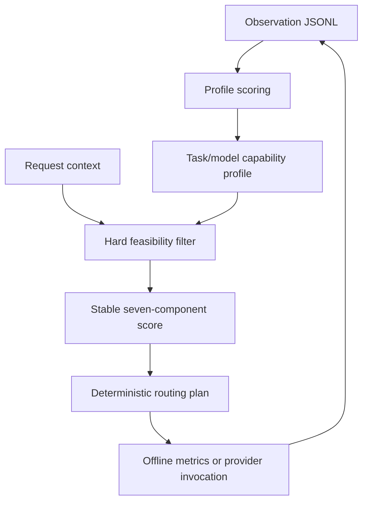

# Architecture

## Research path

The router and experiment harness are standard-library-only. This keeps the research decision logic independently reproducible from the integrated web platform.

## Integrated service boundary

Gateway owns provider credentials, model inventory, routing, fallback, and request/decision audit. Evaluation owns benchmark definitions, model outputs, ratings, judge scores, reports, and capability-profile snapshots. Neither service should read the other service's database; profiles cross the boundary through an authenticated internal HTTP API.

## Decision contract

Explicit `model` requests bypass adaptive selection and are used for reproducible evaluation. Requests without a model provide a task type, objective weights, and optional constraints. The plan contains normalized weights, selected model, eligible fallback order, and all candidate snapshots including rejection reasons.

Latency and cost use fixed-reference inverse transforms. Profile confidence is the product of a sample-count term and exponential time decay. The full scoring method and defaults are documented in `docs/CORE_MODULE.md`.

## Failure behavior

Inactive and unhealthy models are excluded before the pure engine runs. The engine then applies request constraints and orders eligible candidates deterministically. The integrated provider layer retries only a bounded fallback list. Evaluation calls carry an evaluation-run ID; every request receives a trace ID that joins decisions with actual outcomes.

## Non-core boundary

Payment, administration, plugins, large frontends, and deployment conveniences are historical integration material outside the research architecture. Third-party and authorship boundaries are recorded in `docs/PROVENANCE.md`.
